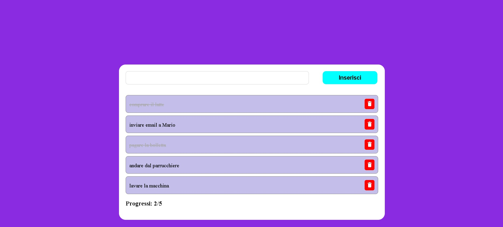

# Simple To-Do List

Una semplice web app per gestire attività quotidiane in modo intuitivo.  
Permette di aggiungere, completare, riattivare e rimuovere task con un’interfaccia pulita e minimale.

---

## 🚀 Funzionalità

- ✍️ **Aggiunta task**: inserisci nuove attività tramite un campo di input dedicato.  
- ✅ **Completamento task**: cliccando su una voce, questa viene depennata e segnata come completata.  
- 🔄 **Riattivazione task**: ricliccando su una voce completata, questa torna nello stato “da fare”.  
- 🗑 **Rimozione task**: ogni task ha un’icona a forma di cestino per eliminarla definitivamente.  
- 📊 **Contatore progresso**: mostra quante attività sono state portate a termine rispetto al totale.  
- ⚠️ **Messaggio di avviso**: se non ci sono task, appare un avviso che ricorda di aggiungerne una nuova.  

---

## 🖼️ Anteprima



---

## 🛠️ Tecnologie utilizzate

- **HTML5**  
- **CSS3** 
- **JavaScript**  

---

## 📦 Installazione & Utilizzo

1. Clona la repository:
   ```bash
   git clone https://github.com/tuo-username/todo-list-app.git
   ```
2. Entra nella cartella del progetto:
   ```bash
   cd todo-list-app
   ```
3. Apri il file `index.html` nel browser.  

---

## 👨‍💻 Autore

Sviluppato da [Gianluca Di Diego](https://github.com/Gianlu201).  
